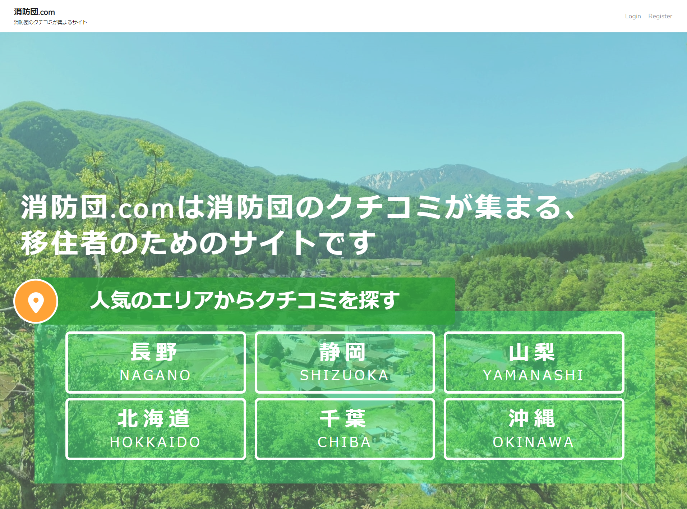
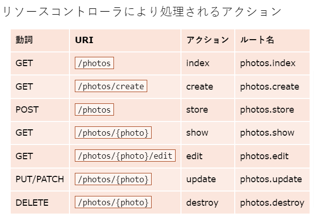

# 消防団.com
 https://shouboudan.tk/index
 
"消防団.com"は移住者のための、全国各地の消防団に関するクチコミサイトです。
 
 
# 概要
消防団に関するクチコミを投稿、閲覧できるサイトです。ユーザー登録機能もありますが、ゲストでの投稿、閲覧も可能です。

また、Twitterから各地域の消防団に関するつぶやきを抽出し、表示させています。そのため、クチコミがない場合も、Twitterから有益な情報が得られる可能性があります。

 
# 開発に至った背景
近年、コロナウイルスによる感染症の影響もあり、都市圏からが地方へ移住する人が増えてきています。 移住を検討するにあたり、様々な項目を調査します。その中でも、地域の消防団[*1]の活動状況を把握したい移住者も多いと考えます。

消防団に入ると、年間を通じて様々な活動があり、入団後のライフスタイルは少なからず影響を受けます。良い面でいうと、消防団の活動が移住先になじむきっかけとなるでしょう。一方で、消防団の行事が負担となり、再び都市圏に逆戻りしてしまう場合もあります。

「消防団への加入は強制なのか」「消防団にはどんな活動・行事があるのか」「消防団はどんな雰囲気なのか」といった情報は、移住者にとって関心度が高いものです。また、移住後のミスマッチを防ぐことにもつながります。

消防団のクチコミサイトは、移住者だけでなく、精力的に活動している消防団にもメリットをもたらします。地域にもよりますが、全国的にみて消防団の加入者は年々減少傾向にあり、団員不足に悩まされている消防団も存在します。

クチコミを通じて、移住者が消防団の活動内容や雰囲気を知ることができれば、消防団員の獲得にもつながるでしょう。

このように、移住者・消防団の双方にとって、消防団のクチコミサイトはメリットをもたらすと考えます。しかし現状、地域の消防団に関する情報を得られる場所がなく、情報が欲しくても手に入らないという問題点があります。

そこで今回、各地域の消防団のクチコミが集まるサイトを開発しました。


[*1]消防団とは、地域の消防活動の他、災害時の救助活動やイベント警備等を担う組織です。消防庁によると以下のように説明されています。

「消防団は、消火活動のみならず、地震や風水害等多数の動員を必要とする大規模災害時の救助救出活動、避難誘導、災害防御活動など非常に重要な役割を果たしています。さらに、平常時においても、住民への防火指導、巡回広報、特別警戒、応急手当指導等、地域に密着した活動を展開しており、地域における消防力・防災力の向上、地域コミュニティの活性化に大きな役割を果たしています。(総務省消防庁."消防団とは".消防団.2022/2/1.https://www.fdma.go.jp/relocation/syobodan/about/)」

 
# 使用技術
 
* PHP 8.0.13
* Laravel 6.20.43
* MySQL 8.0.28
* Nginx 1.20.0
* AWS

    -VPC

    -EC2
    
    -Route53
* Twitter API
* JapanMap.js
 
 
# システム構成図

AWSのVPC上にデプロイメント

 
 

# 機能一覧
* ユーザー機能

    -登録

    -ログイン

    -マイページ

        -マイ投稿一覧

        -もらったいいね数

* クチコミ機能

    -投稿、表示

    -画像投稿、表示

    -コメント投稿、表示

    -いいね

* 投稿検索機能

* ページネーション機能

* Twitterつぶやき表示機能

# 修正点
* 意味のない(なぜしているかわからない)コメントアウトが残っている  
  * 開発時のデバッグ用に残していたような不要なコメントを削除した。

* コーディングルールが統一されていない  
* インデントが統一されていない

  * PSR0, PSR1, PSR2を日本語訳したテキストを一通り読み、概要を学んだ。  
  <https://github.com/maosanhioro/fig-standards/tree/master/translation>

  * VsCodeに拡張機能「php-cs-fixer」を導入しコーディングルールにPSR2を指定し、フォーマットを実施した。
  bladeファイルに対しては「Laravel blade snippets」を導入し、フォーマットを実施した。

* 利用していないファイルが残っている  
  * 利用していないファイルを削除した。

* トランザクションがない

  * DBへ複数の処理が発生する以下の箇所で、beginTransactionメソッドを使用しトランザクションを張るよう記述を変更。  
  <https://readouble.com/laravel/6.x/ja/database.html?header=%25E3%2583%2587%25E3%2583%25BC%25E3%2582%25BF%25E3%2583%2599%25E3%2583%25BC%25E3%2582%25B9%25E3%2583%2588%25E3%2583%25A9%25E3%2583%25B3%25E3%2582%25B6%25E3%2582%25AF%25E3%2582%25B7%25E3%2583%25A7%25E3%2583%25B3>

    * PostControllerクラスのstoreメソッド  
    * PostRepositoryクラスのdestroyメソッド  
    * NiceRepositoryクラスのniceメソッドとunniceメソッド  
    * PostRepositoryクラスのPostDestroyメソッド
    * UserRepositoryクラスのupdateProfileメソッド、updateメソッド

  * 以下のメソッドには例外処理を追記した。  
    * UsersControllerクラスのshowメソッド  
    * PostControllerクラスのdestroyメソッド  

* Laravelの機能である Service層、Repository層が活用されていない  
  * Service層には、ビジネスロジックを、Reository層にはDB操作に関するロジックをそれぞれ切り離した。  
    * app/Services以下に、serviceクラスを作成。ModelやControllerに記述していたロジック部分をこちらに切り離した。  
    * app/Repositories以下に、Repositoryクラスと、それに対応するインターフェースを作成。RepositoryはModelと1対1になるように作成した。  

* app/Http/Requests/PostRequest.php

  * 日本語化が中途半端

    * validation.phpの中身を日本語化した。  
    * エラーメッセージを以下のようにフォームの項目すべてに対して追加した。  
    ```php
       'name.exists' => '名前の入力形式が不正です',
            'gender.required' => '性別を選択してください',
            'gender.regex' => '性別の入力形式が不正です',
            'subject.required' => '件名を入力してください',
            'subject.max' => '件名は80文字以内で入力してください',
            'message.required' => 'メッセージを入力してください',
            'message.max' => 'メッセージは350文字以内で入力してください',
            'city_id.required' => '市区町村を選択してください',
            'city_id.exists' => '市区町村の入力形式が不正です',
            'immigrant.required' => '市区町村との関係を選択してください',
            'immigrant.regex' => '市区町村との関係の入力形式が不正です',
            'imgpath.image' => '画像は画像形式で添付してください',
    ```

  * existsでDBを参照したほうが正確

    * バリデーションルールを以下のように変更した。   
    ```php
      'name' => 'exists:users,name',
      'gender' => 'required|regex:/^[0-2]$/',
      'age' => 'required|integer',
      'subject' => 'required|max:80',
      'message' => 'required|max:350',
      'city_id' => 'required|exists:cities,id',
      'immigrant' => 'required|regex:/^[0-1]$/',
      'imgpath' => 'image',

    ```

* app/Http/Controllers/PostsController.php

  * view(‘bbs.post1’ 1の意図がわからない  
    * ファイル名を見直し、適切な名前に変更した。

  * findOrFailを使っているのに404ページがない  
    * .env内の記述「APP_DEBUG=true」を、falseに変更した。これによりエラー発生時に開発者向けのデバッグ用画面表示からユーザー向けのシンプルな画面表示に変更された。  
    * findOrFailを使用すれば自動的に404ページをLaravel が表示してくれる？findを使用したら上記のような処理が必要。

  * $requestを各変数に入れるならまとめて書いたほうが読みやすい  
    * storeメソッドにおいて、 $request->except([])を用い、リクエストボディからまとめて受け取るよう修正した。  

  * imgのファイル名の重複考慮が不十分  
    * storeAsメソッドで画像ファイルの命名をこちらで操作していたので、storeメソッドに変更し命名をLaravelに任せ、重複が出ないようにした。

* マイグレーション

  * nullable指定が少ないが、仕様的には全て許容していいわけではない気がする  
    * nicesテーブルのpost_id、user_id、ipカラムを、not nullに変更。また、comment_idを削除。マイグレーションファイル「removed_comment_id_from_nices_table.php」を作成し、実行した。
      * 1つ以上のniceは1つのpostに結びついており、nullを許容できないため。  
      * 1つのniceは1人のuserに結びついており、nullを許容できないため。

* app/Services/TwitterService.php

  * env()ではなくconfig()を使う方がいい 
    * configディレクトリ配下に新たにtwitter.phpを作成。config()を使用し、twitter.phpを経由して.envから情報を取得するように変更した。  
    * env() を使わないほうがよい理由  
      config:cacheコマンドを実行した際、.envファイルを読み込まないため。config配下のファイルは読み込むため、configファイル経由で.envの情報を読み込むようにする。  
      <https://readouble.com/laravel/6.x/ja/helpers.html?header=env()>

* route

  * Optional Parametersにしている箇所があるが意味のない使い方に見える  
    * コントローラの使い方を理解できていなかった。特に、リソースコントローラの仕様を把握できていないかったため、web.phpでのルーティングの記述が汚くなってしまっていた。  

  <https://readouble.com/laravel/6.x/ja/controllers.html>
  

    ```php
    Route::resource('pref/{pref_id?}', 'PostsController', ['only' => ['index',  'create', 'store']]);
    Route::get('pref/{pref_id?}/show/{post_id?}', 'PostsController@show')->name('show');
    Route::get('/pref/{pref_id?}/nice/{post_id}', 'NiceController@nice')->name('nice');
    Route::get('/pref/{pref_id?}/unnice/{post_id}', 'NiceController@unnice')->name('unnice');
    ```

  上記の記述から下記に変更した。  

    ```php
    Route::resource('pref_id', 'PostsController', ['only' => ['index','show', 'create', 'store']]);
    Route::get('nice', 'NiceController@nice')->name('nice');
    Route::get('unnice', 'NiceController@unnice')->name('unnice');
    ```

* css/js

  * コンパイル対象が中途半端。コンパイルするなら全部コンパイルで対応した方がいい  
    * 使用するファイルすべてをコンパイルの対象とし、all.jsとall.cssにまとめた。「webpack.mix.js」内の記述を以下のように追加した。

    ```js
     mix.js(['resources/js/app.js', 
         'resources/js/bootstrap.js', 
         'resources/js/jquery-3.6.0.min.js',
         'resources/js/jquery.japan-map.js'],
         'public/js/all.js')
        .sass('resources/sass/app.scss', 'public/css')
        .styles(['resources/css/app.css',
         'resources/css/japanmap.css',
         'resources/css/bbs/sticky-footer.css'], 
         'public/css/all.css')
        .version();
    ```

    その後`npm run dev`を実行しコンパイルをした。

* html

  * styleを直接書くべきではない  
    * cssファイルに写した。
